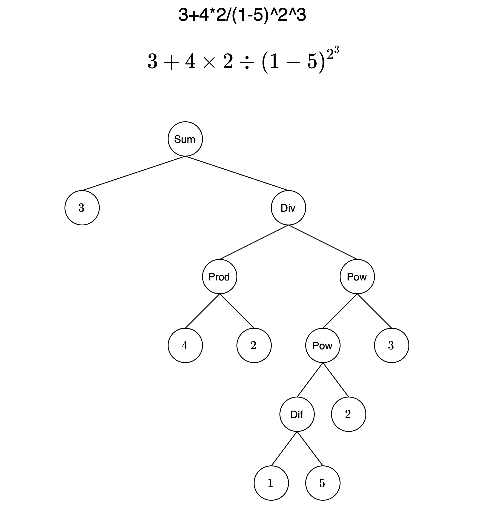

# equation-parser
Simple command line equation parser and evaluator written in Scala to practice functional programming in Scala

[📝 Dev.to post about this project](https://dev.to/leopfeiffer/writing-an-equation-parser-in-scala-1cek)

## Usage

The equation parser comes with a simple CLI. To evaluate an expression, run

```sh
# start the sbt server
sbt

run "<expression>"
```

## Allowed operations

Numbers can be specified as integers (e.g. `42`) or decimals (e.g. `1.23`) and are evaluated as doubles.

Negative numbers must always be wrapped in parentheses (i.e. write `(-42)+2` instead of `-42+2`).

The following operations are allowed:

```
+    Addition
-    Difference
*    Multiplication
/    Division
^    Power
```

You can also use left `(` and right `)` parentheses. Whitespaces are ignored.

### Examples

```
sbt:equation-parser> run "1+2"
3.0
```

```
sbt:equation-parser> run "3 * (1 + 2) ^ 7"
6561.0
```

```
sbt:equation-parser> run "100 / 8 - (2 * 3) + 4 ^ 3"
70.5
```

```
sbt:equation-parser> run "((3 + 2) * (2 + 1)) ^ 2"
225.0
```

```
sbt:equation-parser> run "(-42)^3+(-42)"
-74130.0
```

## Implementation
Evaluating an expression works in two steps:

1. Tokenizing
2. Parsing

The tokenizer converts the raw string into individual tokens. This is quite straightforward and implemented in the `Tokenizer.scala`.

The parser in turn also works in two stages. Firstly, the list of tokens is converted from infix notation (as put in by the user) to [RPN](https://en.wikipedia.org/wiki/Reverse_Polish_notation) using the [Shunting Yard algorithm](https://en.wikipedia.org/wiki/Shunting_yard_algorithm). Parsing the RPN to the final expression is then straightforward. This is implemented in `Parser.scala`.

For example, parsing the equation `3+4*2/(1-5)^2^3` creates the following syntax tree.


